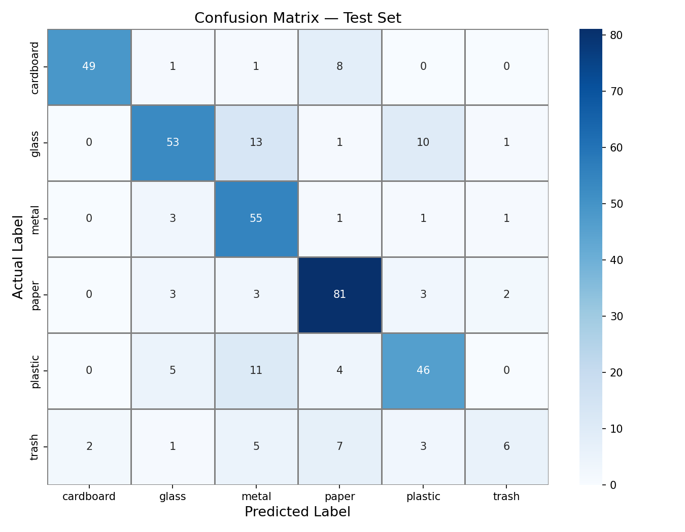
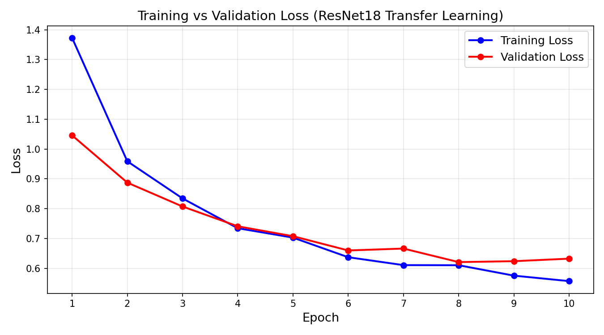
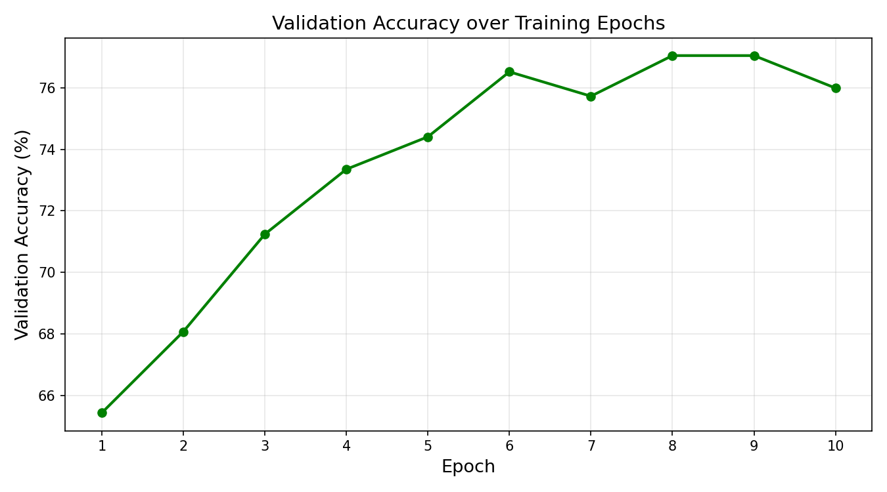

# ♻️ Waste Classification with Deep Learning

A computer vision system that sorts photos of waste into six recycling categories, built with **PyTorch** using transfer learning on a pre-trained **ResNet-18**, with a **Streamlit** web app for live predictions.

Developed as part of the Applied AI module, MSc Artificial Intelligence, University of Greater Manchester.



---

## Results

| Metric | Score |
|---|---|
| Test accuracy | **76.32%** |
| Weighted F1-score | 0.76 |
| Best class | Cardboard (F1 0.89) |
| Hardest class | Trash (F1 0.35, the smallest class) |

Full per-class results are in [`classification_report.txt`](classification_report.txt).

| Loss curve | Validation accuracy |
|---|---|
|  |  |

---

## Approach

- **Dataset:** [TrashNet](https://www.kaggle.com/datasets/feyzazkefe/trashnet), six classes: cardboard, glass, metal, paper, plastic, trash
- **Split:** 70% training, 15% validation, 15% test
- **Model:** ResNet-18 pre-trained on ImageNet, with the convolutional layers frozen and a new classification layer trained for the six classes
- **Augmentation:** random horizontal flips, rotation and brightness/contrast changes on the training set
- **Training:** Adam optimiser, learning rate 0.001, batch size 32, 10 epochs; the model with the lowest validation loss is saved
- **Evaluation:** accuracy, precision, recall, F1-score, confusion matrix and confidence distribution

---

## Getting started

### 1. Clone the repository

```bash
git clone https://github.com/aniqa38/MCS-AI-Applied-Waste-Classification-System-.git
cd MCS-AI-Applied-Waste-Classification-System-
```

### 2. Install dependencies

```bash
pip install -r requirements.txt
```

### 3. Download the dataset

Download TrashNet from Kaggle and place the class folders inside a folder named `dataset/`:

```
dataset/
├── cardboard/
├── glass/
├── metal/
├── paper/
├── plastic/
└── trash/
```

### 4. Train the model

```bash
python app.py
```

This trains the model, saves the best version as `best_waste_model.pth`, and produces the evaluation figures.

### 5. Run the web app

```bash
streamlit run streamlit_app.py
```

Upload a photo of a waste item to see the predicted category and confidence.

To test a single image from the command line, run `python test.py` (it uses `test.jpg`).

---

## Project structure

| File | Purpose |
|---|---|
| `app.py` | Training, evaluation and figure generation |
| `streamlit_app.py` | Web interface for predictions |
| `test.py` | Predicts the category of a single image |
| `classification_report.txt` | Per-class evaluation results |
| `figure*.png` | Training and evaluation charts |

---

## Possible improvements

- Fine-tune deeper ResNet layers rather than only the final layer
- Address the class imbalance (the trash class has far fewer images), for example with weighted loss or oversampling
- Deploy the Streamlit app publicly

---

## Applications

Smart waste sorting, recycling systems and environmental monitoring.

## Author

**Aniqa Arooj**, MSc Artificial Intelligence, University of Greater Manchester
